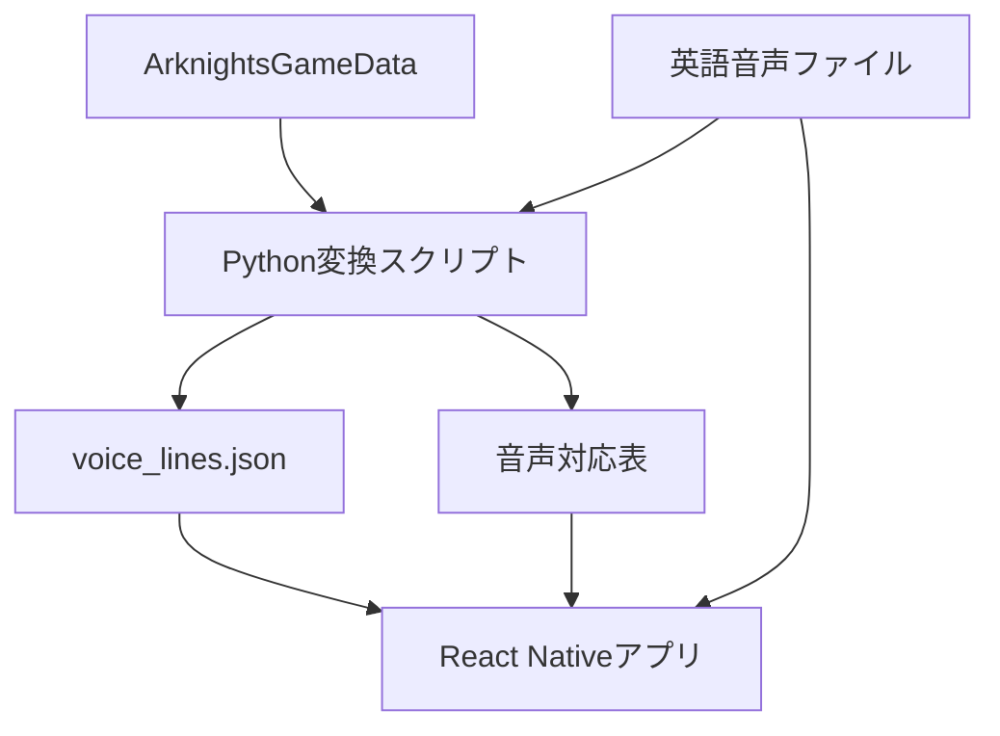

# Arknights English Voice Player 開発フロー

## 1. 目的

アークナイツの英語ボイスを、スマートフォンでオペレーター別に検索・連続再生できる個人利用向けアプリを作る。

最終的に、画面ロック中のバックグラウンド再生、ロック画面からの操作、オフライン再生、お気に入り、プレイリストに対応する。

## 2. 基本方針

* アプリ本体は React Native + TypeScript で実装する。
* React NativeのフレームワークとしてExpoを使用する。
* 音声再生には `expo-audio` を使用する。
* 既存のPythonスクリプトは、ゲームデータからアプリ用JSONを生成する処理として残す。
* React NativeアプリはPythonを直接実行せず、生成済みJSONをTypeScriptで読み込む。
* 音声ファイルとゲーム由来の画像はGitで管理しない。
* Windows PCで開発し、iPhone実機を最初の動作確認対象とする。
* 開発初期はExpo Goを使用し、バックグラウンド再生の検証以降はEASで作成したiOS開発ビルドを使用する。
* 完成後はEASの内部配布ビルドを自分のiPhoneへインストールする。
* 公開配布ではなく、まず自分の端末で使用できる状態を完成目標とする。

## 3. 採用技術

| 用途            | 技術                        |
| :------------ | :------------------------ |
| スマホアプリ        | React Native              |
| 開発フレームワーク     | Expo                      |
| 言語            | TypeScript                |
| 画面遷移          | Expo Router               |
| 音声再生          | expo-audio                |
| メタデータ         | JSON                      |
| お気に入りなどの端末内保存 | AsyncStorage（初期）          |
| 元データの加工       | Python                    |
| 開発PC          | Windows                   |
| 開発対象          | iPhone・iOSを先行             |
| 初期実機確認        | Expo Go                   |
| ネイティブ機能の実機確認  | EAS Development Build     |
| 個人利用版         | EAS Internal Distribution |

## 4. iPhoneでの開発・利用方法

開発は次の3段階に分ける。

| 段階        | iPhoneで使うもの                 | 用途                  | Apple Developer Program |
| :-------- | :-------------------------- | :------------------ | :---------------------- |
| 開発初期      | Expo Go                     | 画面、JSON読み込み、通常の音声再生 | 不要                      |
| ネイティブ機能開発 | Development Build           | バックグラウンド再生、ロック画面操作  | 必要                      |
| 個人利用      | Internal Distribution Build | PCなしで日常的に使用         | 必要                      |

### Expo Goによる確認

Windows側で次を実行し、表示されたQRコードをiPhoneで読み取る。

```powershell
npx expo start
```

Expo Goは開発開始時の確認に使用する。バックグラウンド再生に必要なiOSネイティブ設定を自由に変更できないため、最終的な再生検証には使用しない。

### iOS開発ビルドによる確認

`expo-dev-client` とEASを導入し、自分のiPhoneを登録して開発ビルドを作成する。

```powershell
npm install --global eas-cli
eas login
npx expo install expo-dev-client
eas build:configure
eas device:create
eas build --platform ios --profile development
```

iPhone実機へインストールできるiOSビルドの署名には、有料のApple Developer Programが必要になる。ビルド自体はEASのクラウドで行うため、Windowsから実行できる。

### 完成後の個人利用

完成後は内部配布用ビルドを作り、自分のiPhoneへインストールする。

```powershell
eas build --platform ios --profile preview
```

内部配布版にはJavaScriptコードが含まれるため、PC上で開発サーバーを起動していない状態でも使用できる。

## 5. リポジトリ内の配置案

既存のモノレポに、スマホアプリを独立したアプリとして追加する。

```text
arknights_survey/
├─ data/
│  └─ raw/
│     ├─ ArknightsGameData_YoStar/
│     └─ ArknightsAudio/
│        └─ voice_en/
│
├─ arknights_damage_calculator/
├─ arknights_voice_text_viewer/
│  └─ scripts/
│     └─ build_voice_data.py
│
└─ arknights_voice_player/
   ├─ app/
   ├─ assets/
   │  ├─ data/
   │  │  └─ voice_lines.json
   │  ├─ audio/
   │  └─ images/
   ├─ src/
   │  ├─ components/
   │  ├─ models/
   │  ├─ services/
   │  ├─ player/
   │  ├─ storage/
   │  └─ constants/
   ├─ app.json
   ├─ package.json
   └─ tsconfig.json
```

音声ファイルを大量に `assets/audio` へ直接入れる方式は、アプリ容量とビルド時間を確認してから採用を判断する。最初はテスト用の数件だけを配置する。

## 6. データの流れ



React Native用データには、少なくとも次の項目を持たせる。

```json
{
  "id": "char_002_amiya_001",
  "operatorId": "char_002_amiya",
  "operatorName": "Amiya",
  "voiceTitle": "Appointed as Assistant",
  "textEn": "The English voice line text",
  "textJa": "日本語の台詞",
  "audioFile": "char_002_amiya/CN_001.mp3"
}
```

実際の元データに合わせて項目名を決定し、Python側とTypeScript側で同じ形式を使用する。

## 7. 開発フェーズ

### Phase 0：仕様と利用範囲の固定

実施内容：

1. 個人利用を初期目標とする。
2. 対象音声を英語ボイスに限定する。
3. Windows PCとiPhone実機で開発する。
4. iPhoneを最初の動作確認対象とする。
5. Expo Go、iOS開発ビルド、内部配布版の役割を分ける。
6. 音声ファイルをGitHubへ含めない方針を `.gitignore` に反映する。

完了条件：

* 初期版で実装する機能と、後回しにする機能が区別されている。
* 音声データの保存場所が決まっている。

### Phase 1：React Nativeプロジェクトの作成

実施内容：

1. `arknights_voice_player` をExpoプロジェクトとして作成する。
2. TypeScriptを有効にする。
3. Expo Routerの初期画面を起動する。
4. iPhoneへExpo Goをインストールする。
5. Windowsで `npx expo start` を実行する。
6. QRコードからiPhoneのExpo Goで初期画面を表示する。
7. lintとTypeScriptの型チェックを実行できるようにする。

完了条件：

* iPhoneのExpo Go上に初期画面が表示される。
* TypeScriptの型チェックが成功する。

### Phase 2：最小の音声再生

実施内容：

1. `expo-audio` を導入する。
2. テスト用MP3を1件だけアプリへ入れる。
3. 再生、一時停止、先頭へ戻る操作を実装する。
4. iPhoneのスピーカー、AirPodsまたはイヤホンで確認する。

完了条件：

* 1件の英語ボイスを安定して再生・停止できる。
* 画面を移動しても意図せず再生状態が破棄されない。

### Phase 3：iOS開発ビルド環境の準備

実施内容：

1. Expoアカウントを準備する。
2. `eas-cli` と `expo-dev-client` を導入する。
3. Apple Developer Programへ登録する。
4. `eas build:configure` でEAS Buildを設定する。
5. `eas device:create` で自分のiPhoneを登録する。
6. iOS Development Buildをクラウドで作成する。
7. 作成されたビルドをiPhoneへインストールする。
8. Windowsから `npx expo start` で開発ビルドへ接続する。

完了条件：

* iPhoneのホーム画面から専用の開発アプリを起動できる。
* Windows上のコード変更をiPhoneで確認できる。
* Expo Goでは変更できなかったiOSネイティブ設定が反映される。

### Phase 4：バックグラウンド再生の技術検証

このフェーズは本アプリの成立条件なので、一覧画面の作り込みより先に行う。

実施内容：

1. `enableBackgroundPlayback` を有効にする。
2. iOSの `audio` バックグラウンドモードを有効にする。
3. `shouldPlayInBackground` を含むオーディオ設定を行う。
4. ロック画面とコントロールセンターにタイトル、オペレーター名、画像を表示する。
5. ロック画面から再生・一時停止・前後移動を操作する。
6. 画面ロック中に次のボイスへ切り替える。
7. 通知、着信、Siri、イヤホン切断時の挙動を確認する。
8. AirPodsなどの外部操作を確認する。
9. 30分以上の連続再生テストを行う。

完了条件：

* 画面をロックしても30分以上連続再生できる。
* ロック画面またはコントロールセンターから操作できる。
* 1件の終了後に次の音声が始まる。

### Phase 5：音声データと台詞データの対応付け

実施内容：

1. 現在の `build_voice_data.py` の出力を確認する。
2. 音声ファイル名と台詞IDの対応規則を調査する。
3. React Native用の `voice_lines.json` または音声マニフェストを生成する。
4. 欠損ファイル、重複ID、対応不能データを検出する検証処理を追加する。
5. TypeScriptで `VoiceLine` 型を定義する。
6. JSONを読み込む `voiceLineRepository` を実装する。

完了条件：

* 任意の1オペレーターについて、台詞と正しい音声を対応付けられる。
* 対応できなかったデータ件数をビルド時に把握できる。

### Phase 6：再生キュー

実施内容：

1. 再生中データを管理するプレイヤーストアを作る。
2. 再生キューを作る。
3. 前へ、次へ、自動送りを実装する。
4. リピートなし、全体リピート、1件リピートを実装する。
5. シャッフル再生を実装する。
6. 再生位置と現在の音声を画面へ反映する。

完了条件：

* オペレーター1人分のボイスを順番に連続再生できる。
* バックグラウンド中もキューが進む。

### Phase 7：基本画面

実施内容：

1. オペレーター一覧画面を作る。
2. オペレーター検索を作る。
3. オペレーター詳細とボイス一覧を作る。
4. 画面下部にミニプレイヤーを固定表示する。
5. 再生画面を作る。
6. 英語テキストと日本語テキストを表示する。

完了条件：

* オペレーターを検索し、選択したボイスを再生できる。
* どの画面でも再生中の内容が分かる。

### Phase 8：iPhone端末内への音声保存方式

実施内容：

1. 全音声の容量を計測する。
2. 次の方式を比較して正式方式を決める。
   * アプリへ音声を同梱する。
   * オペレーター単位の音声パックを端末へ取り込む。
   * 個人用の保存場所から端末へダウンロードする。
3. 音声の有無を判定する処理を作る。
4. 未取得音声を画面上で区別する。
5. iOSのアプリ内保存領域とFilesアプリからの取り込みを検証する。
6. オフライン状態と画面ロック状態で再生を確認する。

推奨方針：

* 開発中は少数の音声を同梱する。
* 最終版はオペレーター単位のローカル音声パックを端末へ取り込む方式を第一候補とする。
* 公開サーバーからゲーム音声を配信する方式は採用しない。

完了条件：

* 通信なしで取得済み音声を再生できる。
* 音声ファイルをGitで管理せずに開発できる。

### Phase 9：お気に入りとプレイリスト

実施内容：

1. ボイスのお気に入り登録を作る。
2. オペレーターのお気に入り登録を作る。
3. プレイリストの作成、名称変更、削除を作る。
4. プレイリストへの追加、並べ替え、削除を作る。
5. AsyncStorageへ保存する。

完了条件：

* アプリを終了しても登録内容が保持される。

### Phase 10：品質確認

実施内容：

1. JSON読み込みと再生キューの単体テストを作る。
2. 欠損音声があってもアプリが停止しないようにする。
3. 大量データ表示時の速度を確認する。
4. メモリ使用量とバッテリー消費を確認する。
5. 使用中のiPhone実機で繰り返し確認する。
6. 可能なら異なる画面サイズのiPhoneでも表示を確認する。
7. Wi-Fiとモバイル通信を切った状態で確認する。
8. iOS更新後にバックグラウンド再生を再確認する。

完了条件：

* 主要操作でクラッシュしない。
* 長時間再生してもキューや表示がずれない。

### Phase 11：iPhone個人利用版のビルド

実施内容：

1. アプリアイコンと表示名を設定する。
2. `preview` プロファイルに内部配布設定を行う。
3. iOS内部配布ビルドをEASで作る。
4. 自分のiPhoneへインストールする。
5. PCの開発サーバーを停止した状態で起動する。
6. バックグラウンド再生とオフライン再生を最終確認する。
7. READMEへデータ準備、Expo Go、開発ビルド、内部配布の手順を書く。

完了条件：

* PCへ接続しなくても端末単体で起動・再生できる。
* アプリを再インストールするための手順が残っている。

### Phase 12：Android対応（MVP完成後・任意）

iPhone版のMVP完成後、必要になった場合のみAndroid対応を行う。React Nativeの共通コードを利用しつつ、Androidの通知領域、フォアグラウンドサービス、バックグラウンド再生を別途検証する。

## 8. MVPの範囲

最初の完成版では、次の機能だけを必須とする。

* 自分のiPhoneへ専用アプリとしてインストールできる。
* オペレーターを選択できる。
* 英語ボイス一覧を表示できる。
* ボイスを再生・一時停止できる。
* 前後のボイスへ移動できる。
* 画面ロック中も連続再生できる。
* ロック画面から再生・一時停止できる。
* 英語の台詞を表示できる。
* 取得済み音声をオフライン再生できる。
* PCで開発サーバーを起動していなくても使用できる。

次の機能はMVP完成後に追加する。

* 日本語訳表示の改善
* お気に入り
* プレイリスト
* シャッフルと詳細なリピート設定
* 再生履歴
* 再生速度変更
* Android対応
* 一般公開

## 9. 実装順一覧

```text
1. 開発対象と音声保存場所を確定
2. Expo + TypeScriptプロジェクト作成
3. iPhoneのExpo Goで初期画面を表示
4. Expo Goでexpo-audioによる1件再生
5. Apple Developer ProgramとEASを準備
6. 自分のiPhoneをEASへ登録
7. iOS Development Buildを作成・インストール
8. バックグラウンド・ロック画面再生を検証
9. PythonでReact Native用データを生成
10. TypeScriptでJSONを読み込む
11. 1オペレーター分の台詞と音声を対応付け
12. 再生キューと自動送りを実装
13. オペレーター一覧・検索を実装
14. ボイス一覧を実装
15. ミニプレイヤーと再生画面を実装
16. iPhone向けオフライン音声パック方式を実装
17. お気に入り・プレイリストを実装
18. 長時間再生とiPhone実機テスト
19. iOS Internal Distribution Buildを作成
20. 自分のiPhoneへ個人利用版をインストール
21. 必要になった場合のみAndroid対応
```

## 10. 最初に着手する作業

最初の作業は、データローダーではなくReact Native環境の成立確認とする。

1. `arknights_voice_player` をExpo + TypeScriptで作成する。
2. iPhoneへExpo Goをインストールする。
3. Windowsで `npx expo start` を実行する。
4. iPhoneのExpo Goに初期画面を表示する。
5. テスト用MP3を1件再生する。

この段階まではApple Developer Programへ登録せず、無料で進められる。

その後、バックグラウンド再生へ進む直前に次を行う。

1. Apple Developer Programへ登録する。
2. EAS Buildを設定する。
3. 自分のiPhoneを登録する。
4. iOS Development Buildを作成してインストールする。
5. 画面ロック中の再生を確認する。

ここまで成功した後で、15,817件の既存データとの接続へ進む。
